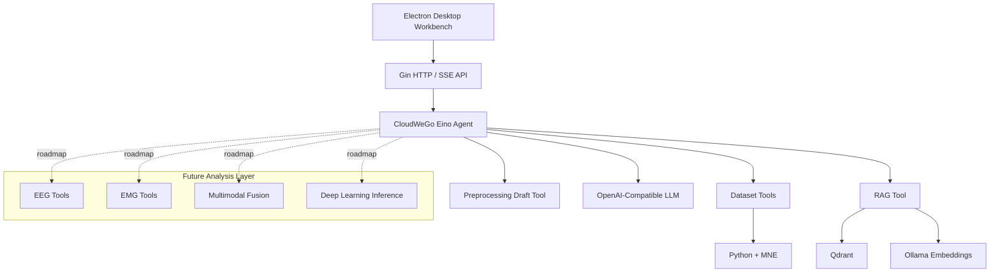
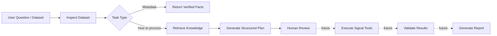

# NeuroFlow

<p align="center">
  <strong>An intelligent neurophysiological signal workbench for EEG, MEG, fNIRS, and future multimodal biosignal workflows.</strong>
</p>

<p align="center">
  <strong>English</strong> · <a href="README_zh-CN.md">简体中文</a>
</p>

<p align="center">
  
  
  
  
  
  
  
</p>

## Overview

**NeuroFlow** is an intelligent agent workspace for neurophysiological signal research. It aims to organize the workflow of **data import → metadata inspection → analysis planning → tool execution → quality review → report generation** into an explainable and reproducible agent system.

The current implementation focuses on three foundations:

- **Trusted local data inspection** — Electron selects local EEG/MEG/fNIRS files, while Python + MNE reads metadata without uploading raw recordings to the LLM.
- **ReAct Agent** — built with CloudWeGo Eino for tool selection, multi-turn interaction, dataset-aware reasoning, and structured preprocessing drafts.
- **RAG knowledge layer** — Markdown knowledge is embedded through Ollama and indexed in Qdrant for domain-grounded responses.

> **Current status:** NeuroFlow can inspect datasets, expose verified metadata to the Agent, retrieve domain knowledge, and generate structured preprocessing plans. It does **not yet** execute a full automatic preprocessing pipeline such as filtering, ICA, bad-channel interpolation, SSS/tSSS, motion correction, or Beer–Lambert conversion. These capabilities are part of the roadmap.

## Why NeuroFlow?

Traditional biosignal software is usually built around fixed menus and fixed pipelines. NeuroFlow explores a different model: the LLM does **not** replace deterministic signal-processing code. Instead, it acts as a planner and orchestrator that selects verified tools, reasons over structured outputs, and explains results.

```text
LLM / Agent = understand + plan + select tools + explain
Signal tools  = calculate + preprocess + validate + infer
```

This separation is central to NeuroFlow's design.

## Current Capabilities

| Area | Status | Description |
|---|---|---|
| Local dataset inspection | ✅ Available | Read format, channels, sampling rate, duration, annotations, modality |
| Dataset-aware Agent context | ✅ Available | Register datasets with `dataset_id` and query verified metadata |
| ReAct tool calling | ✅ Available | Eino Agent can choose registered tools during conversation |
| RAG knowledge retrieval | ✅ Available | Ollama embedding + Qdrant semantic retrieval |
| Structured preprocessing draft | ✅ Available | Generate reviewable plans without pretending they were executed |
| SSE streaming chat | ✅ Available | Stream Agent responses to the desktop UI |
| EEG preprocessing execution | 🚧 Planned | Filtering, notch, referencing, artifact handling, bad channels |
| EMG analysis tools | 🚧 Planned | RMS, MAV, MDF, MPF, activation and fatigue analysis |
| Multimodal EEG/EMG Agent | 🚧 Planned | Synchronization, cross-modal analysis, fusion workflow |
| Automatic analysis reports | 🚧 Planned | Structured metrics, figures, provenance and narrative summary |

## Architecture



## Agent Workflow



The long-term target is a workflow where complex tasks can use **Direct Tool Calling**, **ReAct**, or **Plan–Execute–Replan** depending on task complexity.

## Tech Stack

| Layer | Technology |
|---|---|
| Desktop | Electron, HTML, CSS, JavaScript |
| Backend | Go, Gin |
| Agent | CloudWeGo Eino, ReAct, Tool Calling |
| Neuro data | Python, MNE-Python |
| RAG | Qdrant, Ollama, Markdown chunking |
| LLM | OpenAI-compatible API |
| Streaming | Server-Sent Events (SSE) |
| Protocol | MCP support in dependencies |

> The current repository uses **Gin**, not GoFrame, as the HTTP framework.

## Supported Data Formats

| Modality | Format | Extension | MNE Reader |
|---|---|---|---|
| EEG | European Data Format | `.edf` | `read_raw_edf` |
| EEG | BioSemi Data Format | `.bdf` | `read_raw_bdf` |
| EEG | General Data Format | `.gdf` | `read_raw_gdf` |
| EEG | BrainVision | `.vhdr` | `read_raw_brainvision` |
| EEG | EEGLAB | `.set` | `read_raw_eeglab` |
| EEG | Neuroscan | `.cnt` | `read_raw_cnt` |
| EEG | EGI | `.egi`, `.mff` | `read_raw_egi` |
| EEG / MEG | MNE FIF | `.fif` | `read_raw_fif` |
| MEG | KIT / Yokogawa | `.con`, `.sqd` | `read_raw_kit` |
| MEG | CTF | `.ds` directory | `read_raw_ctf` |
| fNIRS | SNIRF | `.snirf` | `read_raw_snirf` |

BrainVision datasets should keep the matching `.vmrk` and `.eeg` files. EEGLAB datasets using external storage should keep the matching `.fdt` file.

## Quick Start

### Prerequisites

- Windows 10/11 is the primary development environment
- Go 1.25+
- Python 3.9+ with MNE-Python
- Node.js + npm
- Ollama
- Qdrant
- An OpenAI-compatible LLM API

### 1. Clone

```bash
git clone https://github.com/XCZchaos/NeuroFlow.git
cd NeuroFlow
```

### 2. Install Python dependencies

```bash
python -m pip install -r neuro_service/requirements.txt
```

### 3. Install desktop dependencies

```powershell
cd desktop
npm.cmd install
cd ..
```

### 4. Prepare the embedding model

```bash
ollama pull nomic-embed-text
```

### 5. Start Qdrant

```bash
docker run -p 6333:6333 -p 6334:6334 qdrant/qdrant
```

### 6. Create local configuration

Windows PowerShell:

```powershell
Copy-Item config/config_template.json config/config.json
```

Linux/macOS:

```bash
cp config/config_template.json config/config.json
```

Fill in your API key, model name, and OpenAI-compatible API base URL. `config/config.json` is ignored by Git and should never contain credentials that are committed to the repository.

### 7. Start the Go backend

```bash
go run ./cmd
```

The service starts on `http://localhost:8819` by default.

### 8. Start Electron

```powershell
cd desktop
npm.cmd start
```

After importing a dataset, try questions such as:

```text
How many channels are in this file?
What is the sampling rate?
Create an EEG preprocessing draft for resting-state spectral analysis.
```

## Core API

```http
GET  /ping
POST /datasets/register
GET  /datasets/{dataset_id}
POST /agent/preprocessing/draft
POST /chat
POST /chatStream
POST /upload
```

Example dataset registration:

```json
{
  "path": "D:\\NeuroData\\subject01.gdf"
}
```

Example response:

```json
{
  "dataset_id": "d752ed72-41cd-450b-94c2-67eb852a8e94",
  "inspection": {
    "ok": true,
    "format": "GDF",
    "modality": "EEG",
    "sampling_rate_hz": 250,
    "channel_count": 25,
    "duration_seconds": 2748
  }
}
```

## Project Structure

```text
NeuroFlow/
├── cmd/                         # Go service entry
├── config/                      # Local configuration templates
├── desktop/                     # Electron desktop application
├── internal/
│   ├── handler/                 # HTTP handlers
│   ├── repo/qrdant/             # Qdrant repository layer
│   ├── router/                  # API routes
│   └── server/
│       ├── ai/agent/chat/       # ReAct Agent
│       ├── ai/tools/            # Agent tools
│       ├── chatServer/          # Chat / SSE service
│       ├── dataset/             # Dataset registry
│       └── knowledge_index/     # RAG indexing
├── neuro_service/               # Python / MNE adapters
├── pkg/                         # Shared utilities
├── scripts/                     # Helper scripts
├── go.mod
└── go.sum
```

## Design Principles

1. **Verified data over hallucinated facts** — metadata must come from deterministic readers, not the LLM.
2. **Tools perform calculations** — numerical signal analysis belongs in Python/C++/Go tools, not free-form model reasoning.
3. **Explicit provenance** — distinguish observed facts, recommended steps, and actually executed results.
4. **Local-first raw data** — raw neurophysiological recordings should remain local unless the user explicitly chooses otherwise.
5. **Human review for scientific workflows** — generated preprocessing plans are drafts until validated and executed.

## Roadmap

### Phase 1 — Trusted Workspace
- [x] Local dataset import
- [x] MNE metadata inspection
- [x] Dataset registry
- [x] ReAct Agent
- [x] RAG knowledge retrieval
- [x] SSE streaming

### Phase 2 — Deterministic EEG / EMG Tools
- [ ] EEG quality metrics
- [ ] Band-pass and notch filters
- [ ] Referencing and bad-channel handling
- [ ] PSD / band power / time-frequency analysis
- [ ] EMG preprocessing
- [ ] RMS / MAV / MDF / MPF
- [ ] Structured tool-result schema and validator

### Phase 3 — Multimodal Agent
- [ ] EEG Agent
- [ ] EMG Agent
- [ ] Quality Agent
- [ ] Supervisor / Router Agent
- [ ] EEG–EMG synchronization
- [ ] Fusion and cross-modal analysis
- [ ] Plan–Execute–Replan workflow

### Phase 4 — Intelligent Analysis Platform
- [ ] Deep-learning inference tools
- [ ] BIDS-aware dataset parsing
- [ ] Reproducible analysis provenance
- [ ] Automatic figures and reports
- [ ] Public EEG/EMG benchmark workflows

## Recommended Public Test Data

For future EEG/EMG integration tests, NeuroFlow can be evaluated on public datasets such as motor-imagery EEG datasets and datasets containing synchronized EEG/EMG recordings. The test suite should evaluate not only model accuracy, but also:

- correct dataset recognition
- correct tool selection
- parameter validation
- multi-turn dataset context
- structured outputs
- error recovery
- reproducibility of the analysis path

## Development Checks

```bash
go test ./internal/server/dataset ./internal/handler ./internal/server/ai/tools ./internal/server/ai/agent/chat
python -m py_compile neuro_service/inspect_dataset.py
```

```powershell
cd desktop
npm.cmd run check
```

## Contributing

Issues, discussions, research collaboration, BCI competitions, signal-processing modules, Agent workflows, and open-source contributions are welcome.

When adding a new analysis tool, prefer a deterministic interface with explicit input/output schemas. Avoid letting an LLM generate arbitrary Python or shell commands for direct execution.

## License

This project is released under the license included in [LICENSE](LICENSE).

## Disclaimer

NeuroFlow is a research and engineering project. It is **not a medical device** and should not be used for clinical diagnosis or treatment decisions.
