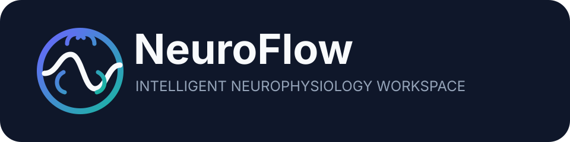
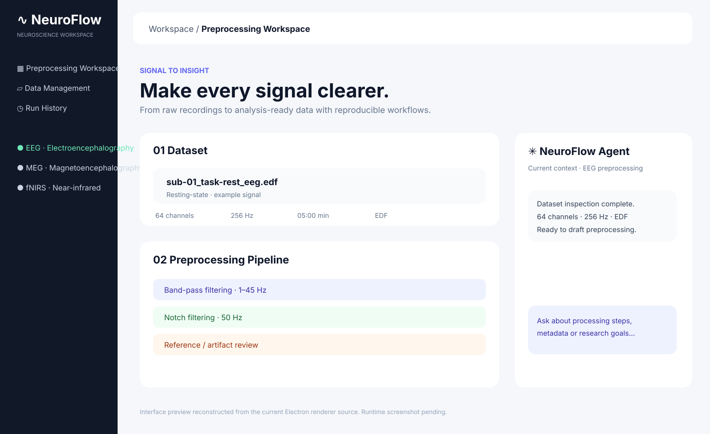
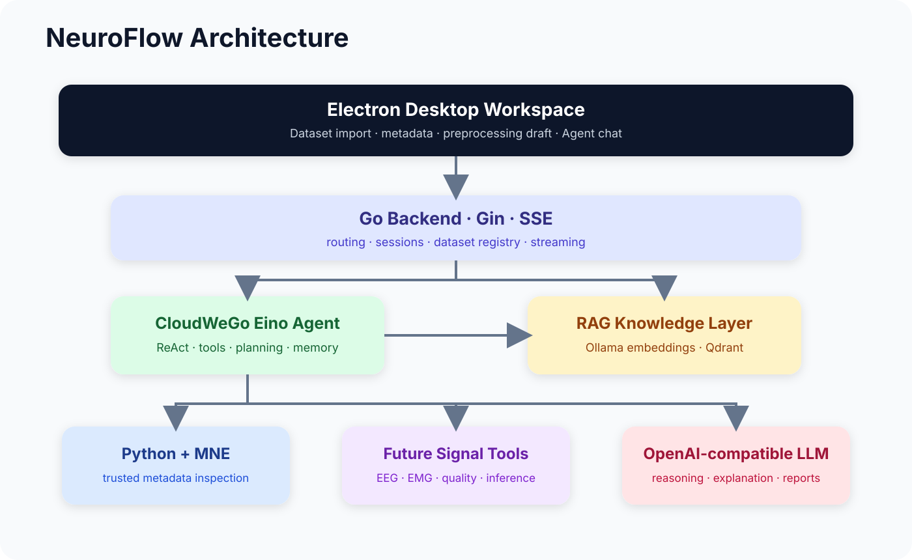

<p align="center"></p>

<p align="center"><strong>An intelligent neurophysiological signal workbench for EEG, MEG, fNIRS, and future EEG/EMG multimodal workflows.</strong></p>
<p align="center"><strong>English</strong> · <a href="README_zh-CN.md">简体中文</a></p>
<p align="center">


</p>

## Overview

**NeuroFlow** is an agent-oriented workspace for neurophysiological signal research. Its goal is to turn **data import → metadata inspection → analysis planning → tool execution → quality review → report generation** into an explainable and reproducible workflow.

The current implementation combines three foundations: trusted local inspection through **Python + MNE**, a **CloudWeGo Eino ReAct Agent** running behind a Go/Gin API, and a **RAG knowledge layer** backed by Ollama embeddings and Qdrant.

> **Current status:** dataset inspection, dataset-aware Agent context, RAG, tool calling, SSE chat, and structured preprocessing drafts are available. Full automatic preprocessing and EEG/EMG analysis execution are still on the roadmap.

## Interface Preview

<p align="center"></p>

> This preview is reconstructed from the current Electron renderer source. It is not presented as a runtime screenshot. A real application screenshot can replace it once runtime capture is available.

## Architecture

<p align="center"></p>

NeuroFlow follows a strict separation of responsibilities:

```text
LLM / Agent = understand + plan + select tools + explain
Signal tools = inspect + calculate + preprocess + validate + infer
```

## Current Capabilities

| Area | Status | Description |
|---|---|---|
| Local dataset inspection | ✅ | Format, channels, sampling rate, duration, annotations and modality |
| Dataset-aware Agent context | ✅ | Register datasets with `dataset_id` and query verified metadata |
| ReAct tool calling | ✅ | Eino Agent can select registered tools |
| RAG knowledge retrieval | ✅ | Ollama embedding + Qdrant retrieval |
| Structured preprocessing draft | ✅ | Reviewable plans without pretending execution occurred |
| SSE streaming chat | ✅ | Stream Agent responses to the desktop UI |
| EEG preprocessing execution | 🚧 | Filtering, referencing, artifacts, bad channels |
| EMG analysis tools | 🚧 | RMS, MAV, MDF, MPF, activation, fatigue |
| Multimodal EEG/EMG Agent | 🚧 | Synchronization, fusion, cross-modal workflow |
| Automatic analysis reports | 🚧 | Metrics, figures, provenance and narrative summary |

## Tech Stack

| Layer | Technology |
|---|---|
| Desktop | Electron, HTML, CSS, JavaScript |
| Backend | Go, Gin |
| Agent | CloudWeGo Eino, ReAct, Tool Calling |
| Neuro data | Python, MNE-Python |
| RAG | Qdrant, Ollama, Markdown chunking |
| LLM | OpenAI-compatible API |
| Streaming | Server-Sent Events (SSE) |
| Protocol | MCP dependencies |

## Supported Data Formats

| Modality | Format | Extension |
|---|---|---|
| EEG | EDF / BDF / GDF | `.edf` `.bdf` `.gdf` |
| EEG | BrainVision / EEGLAB | `.vhdr` `.set` |
| EEG | Neuroscan / EGI | `.cnt` `.egi` `.mff` |
| EEG / MEG | MNE FIF | `.fif` |
| MEG | KIT / Yokogawa | `.con` `.sqd` |
| MEG | CTF | `.ds` |
| fNIRS | SNIRF | `.snirf` |

## Quick Start

```bash
git clone https://github.com/XCZchaos/NeuroFlow.git
cd NeuroFlow
python -m pip install -r neuro_service/requirements.txt
```

Install desktop dependencies:

```powershell
cd desktop
npm.cmd install
cd ..
```

Prepare the knowledge services:

```bash
ollama pull nomic-embed-text
docker run -p 6333:6333 -p 6334:6334 qdrant/qdrant
```

Create local configuration and start the Go backend:

```powershell
Copy-Item config/config_template.json config/config.json
go run ./cmd
```

Start Electron in another terminal:

```powershell
cd desktop
npm.cmd start
```

## Core API

```http
GET  /ping
POST /datasets/register
GET  /datasets/{dataset_id}
POST /agent/preprocessing/draft
POST /chat
POST /chatStream
POST /upload
```

## Project Structure

```text
NeuroFlow/
├── cmd/                    # Go service entry
├── config/                 # Config templates
├── desktop/                # Electron desktop client
├── docs/assets/            # README visual assets
├── internal/               # Handlers, router, Agent, tools, RAG
├── neuro_service/          # Python/MNE adapters
├── pkg/                    # Shared Go utilities
└── scripts/                # Helper scripts
```

## Design Principles

1. **Verified data over hallucinated facts.** Metadata comes from deterministic readers.
2. **Tools perform calculations.** The LLM should not perform scientific numerical analysis itself.
3. **Explicit provenance.** Observed facts, recommendations and executed results must be distinguishable.
4. **Local-first raw data.** Raw recordings stay local unless explicitly shared.
5. **Human review.** Scientific preprocessing plans remain reviewable before execution.

## Roadmap

- [x] MNE metadata inspection
- [x] Dataset registry and Agent context
- [x] ReAct Agent and RAG
- [x] SSE streaming
- [ ] EEG quality metrics and preprocessing tools
- [ ] PSD / band-power / time-frequency tools
- [ ] EMG preprocessing, RMS / MAV / MDF / MPF
- [ ] Quality Agent, EEG Agent, EMG Agent and Supervisor
- [ ] EEG–EMG synchronization and multimodal fusion
- [ ] Plan–Execute–Replan workflow
- [ ] Deep-learning inference tools
- [ ] BIDS-aware datasets
- [ ] Reproducible figures and automatic reports

## Contributing

Issues, research collaboration, BCI competitions, signal-processing modules, Agent workflows and open-source contributions are welcome.

## License

See [LICENSE](LICENSE).

## Disclaimer

NeuroFlow is a research and engineering project. It is **not a medical device** and should not be used for clinical diagnosis or treatment decisions.
