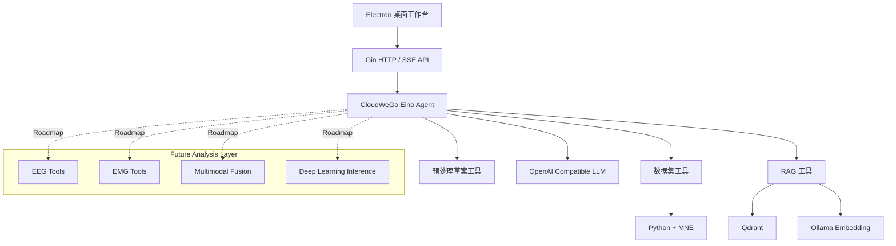
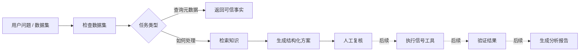

# NeuroFlow

<p align="center">
  <strong>面向 EEG、MEG、fNIRS 及未来多模态生理信号工作流的智能神经信号工作台</strong>
</p>

<p align="center">
  <a href="README.md">English</a> · <strong>简体中文</strong>
</p>

<p align="center">
  
  
  
  
  
  
  
</p>

## 项目简介

**NeuroFlow** 是一个面向神经生理信号研究的智能 Agent 工作台，目标是把 **数据导入 → 元数据检查 → 分析规划 → 工具执行 → 质量复核 → 报告生成** 组织成一套可解释、可复现的智能分析工作流。

当前实现重点围绕三项基础能力展开：

- **可信的本地数据检查**：Electron 负责选择本地 EEG / MEG / fNIRS 文件，Python + MNE 读取文件元数据，原始信号不会直接发送给大模型。
- **ReAct Agent**：基于 CloudWeGo Eino 构建，支持工具选择、多轮对话、数据集上下文和结构化预处理草案。
- **RAG 知识层**：通过 Ollama 生成向量并存入 Qdrant，为 Agent 提供神经信号处理相关知识。

> **当前状态：** NeuroFlow 已支持数据集检查、可信元数据注入、RAG 检索、ReAct 工具调用和结构化预处理规划，但目前还没有完整执行滤波、ICA、坏道插值、SSS/tSSS、运动校正或 Beer–Lambert 转换等真实预处理流程。这些能力属于后续 Roadmap。

## 为什么要做 NeuroFlow

传统生理信号软件通常依赖固定菜单和固定流程。NeuroFlow 希望探索另一种交互方式：**大模型不替代确定性的信号处理算法，而是作为任务理解、规划、调度和解释层。**

```text
LLM / Agent = 理解任务 + 制定计划 + 选择工具 + 解释结果
Signal Tools = 数值计算 + 预处理 + 验证 + 模型推理
```

这是 NeuroFlow 最核心的设计原则之一。

## 当前能力

| 模块 | 状态 | 说明 |
|---|---|---|
| 本地数据集检查 | ✅ 已实现 | 读取格式、通道、采样率、时长、标注和模态 |
| 数据集上下文 | ✅ 已实现 | 生成 `dataset_id` 并让 Agent 查询可信元数据 |
| ReAct 工具调用 | ✅ 已实现 | Eino Agent 在对话中自主选择已注册工具 |
| RAG 知识检索 | ✅ 已实现 | Ollama Embedding + Qdrant 语义检索 |
| 结构化预处理草案 | ✅ 已实现 | 生成可人工复核的处理方案，不伪装成已执行结果 |
| SSE 流式对话 | ✅ 已实现 | 将 Agent 流式响应发送到桌面端 |
| EEG 真实预处理 | 🚧 规划中 | 滤波、陷波、参考、伪迹、坏道处理 |
| EMG 分析工具 | 🚧 规划中 | RMS、MAV、MDF、MPF、激活和疲劳分析 |
| EEG/EMG 多模态 Agent | 🚧 规划中 | 时间同步、跨模态分析和融合工作流 |
| 自动分析报告 | 🚧 规划中 | 指标、图表、来源链路和自然语言总结 |

## 系统架构



## Agent 工作流



后续复杂任务将根据难度分别采用 **Direct Tool Calling、ReAct 或 Plan–Execute–Replan**。

## 技术栈

| 层级 | 技术 |
|---|---|
| 桌面端 | Electron、HTML、CSS、JavaScript |
| 后端 | Go、Gin |
| Agent | CloudWeGo Eino、ReAct、Tool Calling |
| 神经信号 | Python、MNE-Python |
| RAG | Qdrant、Ollama、Markdown 分块 |
| LLM | OpenAI 兼容 API |
| 流式通信 | Server-Sent Events（SSE） |
| 协议 | 依赖中已包含 MCP 支持 |

> 当前仓库实际使用的是 **Gin**，不是 GoFrame。

## 支持的数据格式

| 模态 | 格式 | 扩展名 | MNE 读取器 |
|---|---|---|---|
| EEG | European Data Format | `.edf` | `read_raw_edf` |
| EEG | BioSemi Data Format | `.bdf` | `read_raw_bdf` |
| EEG | General Data Format | `.gdf` | `read_raw_gdf` |
| EEG | BrainVision | `.vhdr` | `read_raw_brainvision` |
| EEG | EEGLAB | `.set` | `read_raw_eeglab` |
| EEG | Neuroscan | `.cnt` | `read_raw_cnt` |
| EEG | EGI | `.egi`、`.mff` | `read_raw_egi` |
| EEG / MEG | MNE FIF | `.fif` | `read_raw_fif` |
| MEG | KIT / Yokogawa | `.con`、`.sqd` | `read_raw_kit` |
| MEG | CTF | `.ds` 目录 | `read_raw_ctf` |
| fNIRS | SNIRF | `.snirf` | `read_raw_snirf` |

BrainVision 数据需要保留匹配的 `.vmrk` 和 `.eeg` 文件；使用外部存储的 EEGLAB 数据需要保留 `.fdt` 文件。

## 快速开始

### 环境依赖

- Windows 10/11 为当前主要开发环境
- Go 1.25+
- Python 3.9+ 与 MNE-Python
- Node.js + npm
- Ollama
- Qdrant
- OpenAI 兼容的大模型 API

### 1. 克隆仓库

```bash
git clone https://github.com/XCZchaos/NeuroFlow.git
cd NeuroFlow
```

### 2. 安装 Python 依赖

```bash
python -m pip install -r neuro_service/requirements.txt
```

### 3. 安装桌面端依赖

```powershell
cd desktop
npm.cmd install
cd ..
```

### 4. 准备 Embedding 模型

```bash
ollama pull nomic-embed-text
```

### 5. 启动 Qdrant

```bash
docker run -p 6333:6333 -p 6334:6334 qdrant/qdrant
```

### 6. 创建本地配置

Windows PowerShell：

```powershell
Copy-Item config/config_template.json config/config.json
```

Linux/macOS：

```bash
cp config/config_template.json config/config.json
```

填写 API Key、模型名和 OpenAI 兼容 API 地址。`config/config.json` 已加入 Git 忽略规则，不要把真实密钥提交到仓库。

### 7. 启动 Go 后端

```bash
go run ./cmd
```

默认服务地址：`http://localhost:8819`。

### 8. 启动 Electron

```powershell
cd desktop
npm.cmd start
```

导入数据后可以尝试：

```text
这个文件一共有多少个通道？
采样率是多少？
帮我为静息态频谱分析生成一份 EEG 预处理草案。
```

## 核心 API

```http
GET  /ping
POST /datasets/register
GET  /datasets/{dataset_id}
POST /agent/preprocessing/draft
POST /chat
POST /chatStream
POST /upload
```

注册数据示例：

```json
{
  "path": "D:\\NeuroData\\subject01.gdf"
}
```

响应示例：

```json
{
  "dataset_id": "d752ed72-41cd-450b-94c2-67eb852a8e94",
  "inspection": {
    "ok": true,
    "format": "GDF",
    "modality": "EEG",
    "sampling_rate_hz": 250,
    "channel_count": 25,
    "duration_seconds": 2748
  }
}
```

## 项目结构

```text
NeuroFlow/
├── cmd/                         # Go 服务入口
├── config/                      # 本地配置与模板
├── desktop/                     # Electron 桌面端
├── internal/
│   ├── handler/                 # HTTP Handler
│   ├── repo/qrdant/             # Qdrant 数据访问层
│   ├── router/                  # API 路由
│   └── server/
│       ├── ai/agent/chat/       # ReAct Agent
│       ├── ai/tools/            # Agent Tools
│       ├── chatServer/          # 对话与 SSE
│       ├── dataset/             # 数据集注册表
│       └── knowledge_index/     # RAG 索引
├── neuro_service/               # Python / MNE 适配层
├── pkg/                         # 通用组件
├── scripts/                     # 辅助脚本
├── go.mod
└── go.sum
```

## 设计原则

1. **可信数据优先**：元数据必须来自确定性读取器，而不是由 LLM 推测。
2. **数值计算交给工具**：滤波、PSD、RMS、模型推理等必须由 Python/C++/Go 工具执行。
3. **明确来源链路**：区分“已经观察到的事实”“推荐步骤”和“真正执行后的结果”。
4. **原始数据本地优先**：除非用户主动选择，否则原始神经生理信号不发送给大模型。
5. **科研流程保留人工复核**：Agent 生成的是分析方案，真正执行前仍应确认参数和实验背景。

## Roadmap

### Phase 1 — Trusted Workspace
- [x] 本地数据导入
- [x] MNE 元数据检查
- [x] Dataset Registry
- [x] ReAct Agent
- [x] RAG 知识检索
- [x] SSE 流式响应

### Phase 2 — EEG / EMG 确定性工具
- [ ] EEG 信号质量指标
- [ ] 带通滤波与陷波
- [ ] 重参考与坏道处理
- [ ] PSD / Band Power / 时频分析
- [ ] EMG 预处理
- [ ] RMS / MAV / MDF / MPF
- [ ] 统一 Tool Result Schema 与结果验证器

### Phase 3 — 多模态 Agent
- [ ] EEG Agent
- [ ] EMG Agent
- [ ] Quality Agent
- [ ] Supervisor / Router Agent
- [ ] EEG–EMG 时间同步
- [ ] 融合与跨模态分析
- [ ] Plan–Execute–Replan 工作流

### Phase 4 — 智能分析平台
- [ ] 深度学习模型推理工具
- [ ] BIDS 数据结构自动识别
- [ ] 可复现分析 provenance
- [ ] 自动图表与报告
- [ ] 公共 EEG/EMG 数据集 Benchmark 工作流

## 公共数据测试方向

后续 EEG/EMG 联调可以优先使用公开运动想象数据集以及同步 EEG/EMG 数据集。测试目标不应只关注分类准确率，还应覆盖：

- 数据集是否正确识别
- Agent 是否选择正确工具
- 工具参数是否合法
- 多轮对话是否保持当前数据集上下文
- Tool 输出是否结构化
- 异常情况下是否能够恢复或重新规划
- 整条分析路径是否可复现

## 开发检查

```bash
go test ./internal/server/dataset ./internal/handler ./internal/server/ai/tools ./internal/server/ai/agent/chat
python -m py_compile neuro_service/inspect_dataset.py
```

```powershell
cd desktop
npm.cmd run check
```

## 参与项目

欢迎通过 Issue 或 Pull Request 参与 NeuroFlow，包括：

- EEG / EMG / fNIRS 信号处理工具
- Agent 工作流设计
- BCI 比赛与公开数据集测试
- RAG 知识库扩展
- 桌面端与可视化改进
- 科研合作与开源项目合作

新增分析 Tool 时，建议优先采用明确的输入/输出 Schema 和可验证算法实现，不建议让大模型生成任意 Python 或 Shell 命令后直接执行。

## License

本项目遵循仓库 [LICENSE](LICENSE) 中声明的开源许可证。

## 免责声明

NeuroFlow 是科研与工程项目，**不是医疗器械**，不应直接用于临床诊断或治疗决策。
