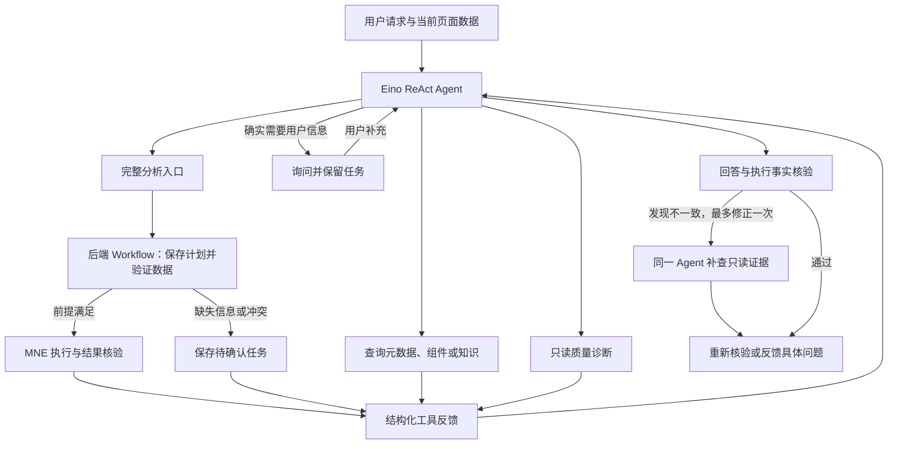

# NeuroFlow Agent 工程原则

设计参考：[Anthropic — Building effective agents](https://www.anthropic.com/engineering/building-effective-agents)。文章区分预定代码路径的 Workflow 与模型动态选择工具的 Agent，强调简单设计、清楚的工具接口、真实环境反馈和评测。它提供可组合的模式，不要求使用全部模式。

下面是 NeuroFlow 根据自身代码与数据处理需求作出的工程约定，具体预算、权限和状态协议是本项目的选择，不是 Anthropic 的强制规范。

## 主流程与决策的分工



**程序决定执行边界。** 数据集与页面绑定、参数物理约束、任务版本、用户不保存要求、取消信号和重复执行保护位于服务端。处理结果由实际 Python/MNE 调用产生。提示词提醒模型这些边界，不能代替代码校验。

**模型决定开放步骤。** 根据用户目的与工具反馈选择查询、诊断、处理、补查依据或提出具体问题。新完整分析由一次 `run_neuro_analysis(full)` 调用衔接后端任务；不让模型为一次普通操作反复搬运中间状态。已有任务通过任务工具恢复。

**等待只阻塞依赖缺失信息的工作。** 事件语义未确认时暂停事件相关分析；独立的只读诊断在信号结构满足其前提时仍可执行。RAG 无命中或故障不自动等同于所有操作不可用。模型仍需说明缺失依据，不能虚构科学结论。

## 工具接口约定

新增或修改工具时，一起维护以下内容：

| 内容 | 在 NeuroFlow 中的要求 |
| --- | --- |
| 选择边界 | 写清何时调用、与相似工具的区别；如草案工具不执行分析，quality 不代表预处理完成 |
| 参数 | 提供 JSON Schema 类型、枚举、单位、默认行为和简短示例；服务端仍独立验证实际参数 |
| 输入来源 | 使用当前绑定的 `dataset_id`；用户声明须保留原话；不要求模型提供本地文件路径或原始采样数组 |
| 结果 | 返回事实、状态、具体问题及后续可选动作；波形留在本地结果接口，避免塞入模型上下文 |
| 可恢复错误 | 参数缺失、任务状态冲突等作为结构化观察返回；模型可改正调用，不能无条件原样循环 |
| 副作用 | 写清是否保存文件、修改配置或更新候选标签；运行失败后不假设前次没有产生副作用 |
| 用户反馈 | 发送真实工具和步骤事件；区分任务等待、任务完成与单次工具查询结束 |

`run_neuro_analysis(full)` 和 `manage_preprocessing_task` 共享任务观察格式，保留原有 `task` 完整证据：

```json
{
  "ok": true,
  "status": "waiting_for_input",
  "completed": false,
  "pending_fields": [{"name": "unit", "question": "Signal unit?"}],
  "next_action": "Use current user-provided answers or ask for the missing unit.",
  "task": {"id": "example", "revision": 3, "status": "waiting_for_input"}
}
```

此例缩略了 `task`。`ok=true` 表示正常返回可用状态，不代表处理完成；失败和中断任务返回 `ok=false`，无任务查询返回 `status=not_found`。判断完整任务成功使用 `completed=true`，具体算法是否跳过仍看 `task.result` 和步骤记录。

顶层 `pending_fields` 只包含尚无答案的字段。原始问题仍留在 `task.pending_fields` 用于审计；有答案但验证失败时，查看 `task.validation` 和阻塞步骤的详情。`next_action` 是状态相关的操作指引，不是模型必须逐字复述的回复模板。

`ready` 表示可以继续执行：若用户已要求处理，就用最新 `task.revision` 调用 `resume`；若用户只要求验证，报告验证结果即可。请求参数错误返回 `status=error` 和具体 `message`，不把失败解释成“正在后台处理”。

## 关键代码位置

| 文件 | 负责什么 |
| --- | --- |
| [`new_react_agent.go`](../internal/server/ai/agent/chat/new_react_agent.go) | 模型、工具注册、Eino 循环与每轮图步骤预算 |
| [`graph.go`](../internal/server/ai/agent/chat/graph.go)、[`mode_retrieval.go`](../internal/server/ai/agent/chat/mode_retrieval.go) | 外层上下文和按模式检索；检索器缺失时向模型说明证据不可用 |
| [`chat_template.go`](../internal/server/ai/agent/chat/chat_template.go) | 模型任务说明与证据要求 |
| [`preprocessing_request.go`](../internal/server/ai/tools/preprocessing_request.go) | 完整分析的一次调用入口，衔接创建、验证与执行 |
| [`preprocessing_task.go`](../internal/server/ai/tools/preprocessing_task.go) | 任务恢复协议、真实验证与执行 |
| [`task_observation.go`](../internal/server/ai/tools/task_observation.go) | 统一状态、未答字段、完成标志和后续指引 |
| [`python_analysis.go`](../internal/server/ai/tools/python_analysis.go)、[`workspace.go`](../internal/server/ai/tools/workspace.go) | 实际执行、页面和数据集范围约束、事件反馈 |
| [`answer_repair.go`](../internal/server/chatServer/answer_repair.go) | 发现回答与工具事实不一致时，有界补查与修正 |

## 验证标准

先看可观察行为，再决定是否增加规划轮次、检索或额外 Agent。

| 场景 | 要观察的行为 | 自动回归位置 |
| --- | --- | --- |
| 已确认数据只需滤波，用户说不保存 | 一次完整入口经过验证与执行；没有处理文件输出 | `tools/preprocessing_request_test.go` |
| 任务缺研究目标，用户先看质量 | 只读诊断能执行；原等待任务和答案不变 | `tools/preprocessing_request_test.go` |
| 任务有未答字段、答案冲突或失败 | 区分等待、验证问题与完成；已答字段不被重复列为未答 | `tools/task_observation_test.go` |
| 模型误调 resume | 真实错误进入模型上下文，可继续查状态；任务没有偷偷执行 | `agent/chat/tool_feedback_test.go` |
| 检索不可用 | 不把失败当证据；ReAct 仍可接收请求和工具反馈 | `agent/chat/tool_feedback_test.go`、`tools/answer_repair_test.go` |
| 模型文字声称做了未执行的处理 | 只读修正最多一次，不重复执行；只保存最终核验答复 | `chatServer/answer_repair_test.go` |
| 工具持续调用或用户取消 | 图步骤预算和取消生效，不无限循环 | `agent/chat/mode_agent_test.go`、`chatServer/answer_repair_test.go` |

测试路径以上述 `internal/server/ai/` 为起点，其中 `chatServer/` 位于 `internal/server/`。

```powershell
go test ./internal/server/ai/agent/chat ./internal/server/ai/tools ./internal/server/chatServer
cd desktop
npm run test:stream
npm run test:lifecycle
```

模拟模型测试证明调用链和保护逻辑可用，**不等于证明真实模型会做出正确决策**。更换模型或修改提示词后，应使用同一组已确认测试数据和请求多次验收，记录任务完成率、不必要追问数、重复执行数、工具失败后恢复率、无证据完成声明数，以及耗时和 token 用量。记录服务商、模型、随机性、模式和代码版本；目前尚未建立这些真实模型指标的自动统计看板。

当前仍有启发式问题路由和基于规则的回答核验；快速/深度模式也保留默认检索预算。是否取消这些固定策略，应通过上述行为评测判断。模型输出修正不能代替科研方法有效性的独立验证。
